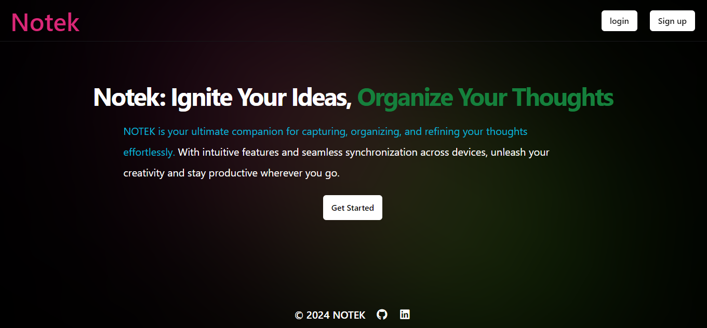
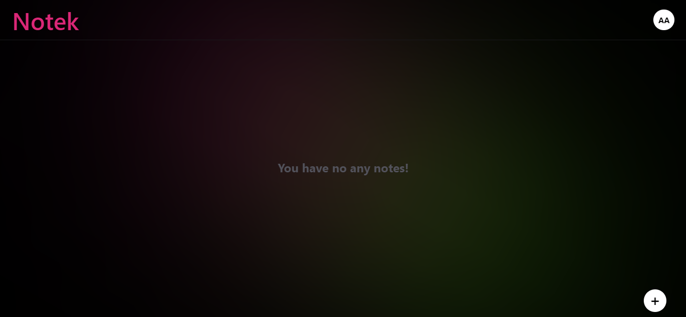
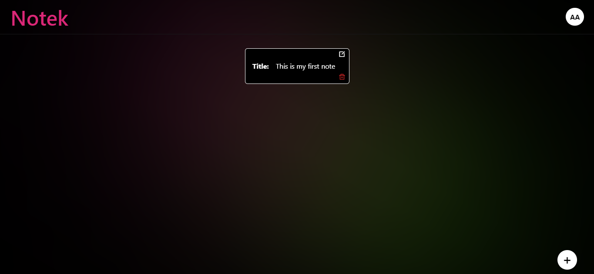
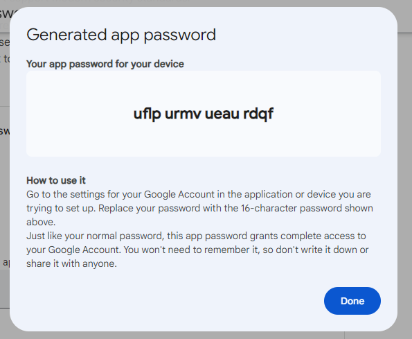

# NOTEK : A web app for note taking.
<br/>
<br/>
<br/>

# BUILD WITH: MEEN --> MongoDB, EXPRESS, EJS, NODE.JS
<br/>
<br/>
<br/>

# Features:

## CRUD OPERATIONS
###  Create , Read , Update and Delete.

## Authentication
### Login , Signup

## Email Verification During Signup

<br/>
<br/>
<br/>


## SOME  PREVIEWS
### HomeLogOut


### Home Login Blank


### Home Login With Note


<br/>
<br/>
<br/>

# Running the Project Locally
### To run this project on your local system, setup few things before cloning the repo!:

### First, go to the <a href="https://myaccount.google.com/security">Gmail Account Security Settings</a> In the search bar, type "app password" and follow the instructions to create an app password for your Gmail account then copy password and save it, This will be used for email verification.

# App Password look Like:


#### Note: 2-Step verification must be enabled on your Gmail account; otherwise, you will not be able to create an app password.

<br/>
<br/>
<br/>

# Database Connection

## To set up the database connection, follow these steps:

### 1. Go to <a href="https://cloud.mongodb.com/"> MongoDB Cloud.</a> If you do not have an account, create one.

### 2. Create a database cluster. if you don't know how to create a cluster on MongodB then simply search on <a href="https://www.youtube.com/results?search_query=how+to+create+a+cluster+on+MongodB">Click Here</a>

### 3. Copy the MONGODB_URI and save it. This will be used to store our user information.

<br/>
<br/>
<br/>

# Installation

1. Clone this repository to your local machine.

```bash
git clone https://github.com/Emmraan/notek.git
```

2. Navigate to the project directory.

```bash
cd  notek
```
3. Install dependencies using npm:

```bash
npm install
```
<br/>
<br/>
<br/>

# Setting Up Environment Variables

```JavaScript
1. Follow these steps to set up your environment variables:

2. Create a new .env file in the root directory of this project.

3. Copy the variables from .env.example and paste them into the new .env file.

4. Replace the placeholder values with your own.

In the .env file, use the following format:


# Replace the username password and Database name.
1. MONGO_URI="mongodb+srv://<username>:<password>@cluster0.4m7l6.mongodb.net/<yourDBname>?retryWrites=true&w=majority&appName=Cluster0"

# Generate or create a long hex secret for JWT_SECRET, e.g., 7f45d1f47ebf4e1af1e148cd00fe97e5472df8e5b5c8e8af

2. JWT_SECRET=your_jwt_seceret_here

3. PORT=3000

4. USER= <here your email>

5. PASS= <here your app password>

# This domain is attached before email_verify route!
# For development purposes, use: localhost:3000
6. DOMAIN= <here your domain> 

```


### To start the development server, run the following command:
```
npm run dev
```
### Server Auto-Restart with Nodemon 🔄
### Accessing the Server On 🌐 http://localhost:3000

<br/>
<br/>
<br/>


# Want to run it in a Docker container?
### Note: Make sure .env file is setup in your root directory before build the docker image, and <a href="https://docker.com">DOCKER</a> installed in your system!

## Build Docker image

```Dockerfile
# Build the app
docker build -t your-app-name .

# Run Docker container for development
docker run -d -p 3000:3000 --env-file .env --name your-container-name your-app-name npm run dev

# Or, run Docker container for production
docker run -d -p 3000:3000 --env-file .env --name your-container-name your-app-name npm run start

# To stop the container
docker stop your-container-name

# To remove the container
docker rm your-container-name

# To remove the image
docker rmi your-image-name
```
### Accessing the Container On 🌐 http://localhost:3000